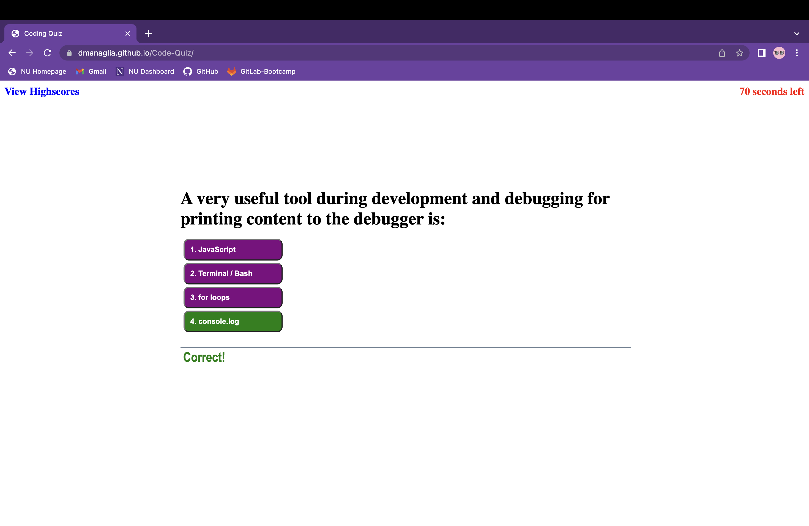
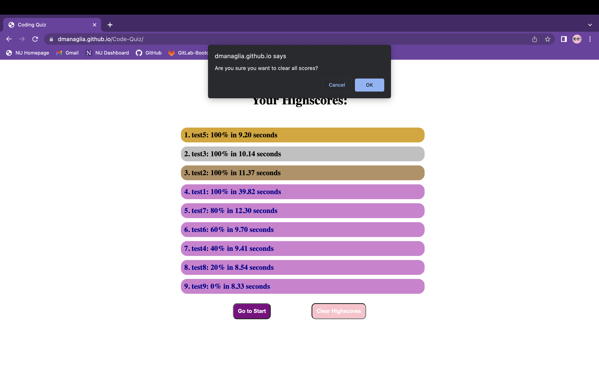

# Coding-Quiz

As a web developer in training, the coding quiz has been a great way to test my knowledge. The questions themselves are trivial but the challenge was designing the quiz. It was a great way to practice manipulating the DOM, adding event listeners, structuring a complex flow of code and familiarizing myself with styling techniques. I learned a lot by building this webpage from essential takeaways like local storage variables to minor styling rules such as how css' psudo classes can be effected by JavaScript.

The entire quiz, submit and highscore display are all on one webpage, there is no linking to different pages whatsoever. Because of that I am much more familiar with creating, removing and manipulating elements through JavaScript than before, a skill I'm eager to continue to develope and discover the true extent of its applications in web developement.

There was also quite a bit of logic practice throughout the process from tracing the flow of my code to sorting the highscores list based on 2 different variables. Although I took the longer route a couple of places such as "stringifying" my objects manually rather than using JSON and ordering my highscores list manually rather than using a sort method, it was a great way to practice my logic, testing, debugging and overall understanding of the fundementals of JavaScript. 

Another skill I had to develope and utilize was thinking ahead to ensure my code would not break if the user did something unexpected, such as click on buttons rapidly. In this case it wasn't too tricky to simply remove the event listeners for the one second while the answer information is being displayed. By trying to forsee unexpected behavior I was able to close a lot of gaps in my code.

## Installation

No installation necessary just click the link below to view!

[Click here to go to live link](https://dmanaglia.github.io/Code-Quiz/)

## Usage

The quiz is rather intuitive and the essential information can be found in a paragraph when the webpage firsts loads. 

To begin just click "Start Quiz" You have 75 seconds to complete the quiz, if you choose the wrong answer 15 seconds will be deducted from the amount of time you have remaining. When you select an answer, the page will turn the button you pressed the appropriate color (green for correct, red for incorrect) as well as display a message that will read "Correct" or "Wrong." The message will display for exactly 1 second before the quiz continues during which time the timer in the top right will be paused. 

At any point during the quiz you can click on the "View Highscores" link in the top left of the page. This acts like a pause button since you will be able to resume the quiz with all the progress saved by clicking the "Resume Quiz" button underneath the highscore list. 

You can also click on this link when the page first loads or before you submit you score. In either case you will then be directed to the starting page when you are done looking at the highscores (you cannot go back to then submit your score, if you do not submit it, it will be lost forever so be careful!). The highscore list is kept in local storage so if you refresh the page your highscores will remain! If at any point you wish to clear your highscores there is a button that will delete all scores. The page will first make sure you want to clear the highscores, if you are sure just click OK and they will be gone forever. 

The scores are ordered from best percentage to worst percentage. If you have multiple scores with the same percent they will then be ranked based on the exact amount of time it took to complete the quiz. Your best score will be at the top of the list with a golden background, seconds to best has a silver background and third is a bronze background, any other scores have a default light purple background display.

I also found it fitting to randomize the order in which the questions will appear so that you can't just memorize the order, so stay on your toes!

## License

Please refer to the LICENSE in the repo.